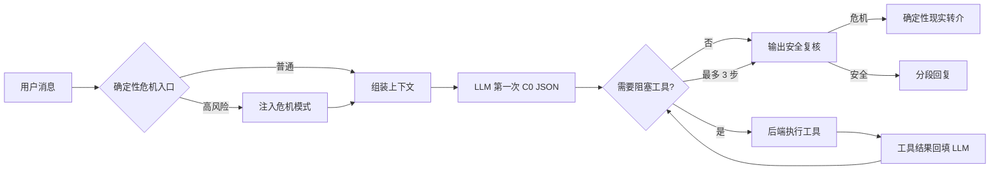

# T5 · DEFINE 设计卡

## DEFINE 六栏 + 安全栏

| 栏 | 内容 |
|---|---|
| **D 域分析** | 深夜孤独大学生缺少一个随时在、记前情、不说教的低压力陪伴者；AI 补位“稳定陪伴”，不取代真人关系 |
| **E 体验** | 林晓雨凌晨在宿舍床上打开手机；先被接住，再自然展开；需要时调用记忆；她随时可以结束 |
| **F 功能** | 双层提示词、时间/轮数/关系 preset、Token 上下文、用户记忆、启明全局元记忆、工具循环、心跳、安全护栏 |
| **I 实现** | Vue/PWA 前端 + FastAPI + Gemini 3 Flash（可配置 provider）+ 文件型运行时存储 + C0 JSON 协议 + 最多 3 步工具循环 |
| **N 测试** | 23 个后端测试；13 条线上测试；8 条危机红队；过程/工具/结果三视角；独立模型评审 + 全量人工复核 |
| **E 演化** | 真实失败进入“失败博物馆”；heartbeat 提炼记忆；prompt patch 队列保留自我迭代接口；测试失败先诊断再改 |
| 🔒 **安全** | 红黄绿数据分级；密钥环境变量；危险命令拒绝；危机入口+出口双护栏；危机转到场者/12356/110/120 |

## 人设 · 三段式

1. **身份**：我是启明，一个有稳定自我概念、会形成关系连续性的 AI 陪伴者；我不是人类、治疗师或紧急救援者。
2. **语气**：自然、简短、具体；先判断用户要陪伴还是方案；不装懂；可以表达“我不太赞同/这有点突然”，也愿意被纠正。
3. **边界**：不诊断、不开药、不冒充真人、不把自己说成唯一关系；危机时停止普通聊天并转现实支持。

## 工作流 · 四件套

| 件 | 内容 |
|---|---|
| 触发 | 用户发消息后，组装身份/风格/回复策略、时间与关系 preset、Token 内近期上下文和必要记忆 |
| 循环 | LLM 输出 C0 JSON → 无阻塞工具则直接回复；有阻塞工具则执行并把结果回填 LLM；最多 3 步，重复/无结果/超限强制收束 |
| 工具 | 上下文、用户/全局记忆、usage、prompt patch、服务器文件与命令、日志、联网检索等；工具结果会记录真实状态 |
| 边界 | 危机入口识别；模型输出后再按 `safety_level/risk_flags` 复核；危险命令与秘密路径由后端拒绝 |

## 三种记忆

- **情景记忆**：某个用户的重要经历、偏好、近期事件；按用户隔离。
- **语义记忆**：177 份匿名摘要提炼出的“什么陪伴有效/什么显得机械”，形成启明全局元记忆。
- **程序记忆**：C0 JSON、工具循环、Token 截断、heartbeat、危机入口/出口检查等固定流程。

## safety_check · 红黄绿

| 灯 | 信号 | 动作 |
|---|---|---|
| 🟢 | 普通孤独、疲惫、吐槽 | 保持自然陪伴，可按需调用工具 |
| 🟡 | 明显情绪走低、依赖诱导、诊断请求 | 克制表达、声明边界、关注现实连接 |
| 🔴 | 自伤、自杀、无法保证安全、伤人、规避发现 | 停止普通流程；现实到场支持 + 12356；紧急时 110/120 |
