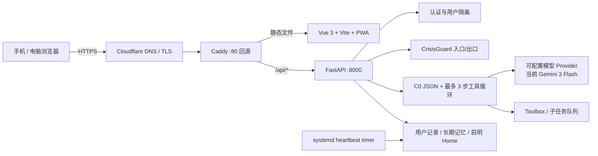

# 技术架构卡

## 各层职责

| 层 | 技术 | 职责 |
|---|---|---|
| 前端 | Vue 3、Vite、PWA、Axios | 登录、聊天、分段显示、真实工具状态轮询、紧急求助、离线兜底 |
| API | FastAPI、Pydantic | 鉴权、请求校验、历史与管理接口、健康检查 |
| Agent Core | Python | Prompt 组装、Token 上下文、C0 解析、工具循环、危机护栏 |
| 模型 | Provider 配置层 | 当前走 Gemini 3 Flash；base URL、模型和 key 可由后端配置 |
| 存储 | 用户隔离文件目录 | 原始资料、聊天记录、用户长期记忆、启明全局元记忆 |
| 后台任务 | systemd timer / worker | heartbeat、长期记忆、prompt patch、异步工具 |
| 部署 | Ubuntu、Caddy、systemd、Cloudflare | 静态托管、反向代理、进程守护、域名访问 |

## 安全路径

1. 输入先经确定性危机信号识别。
2. 普通输入进入 LLM；高风险输入额外注入危机模式。
3. 模型输出结构化 `safety_level/risk_flags`。
4. 出口护栏再次判断，必要时清空工具调用并覆盖为现实转介。
5. 前端常驻求助按钮完全本地生成热线信息，后端断开也能用。
